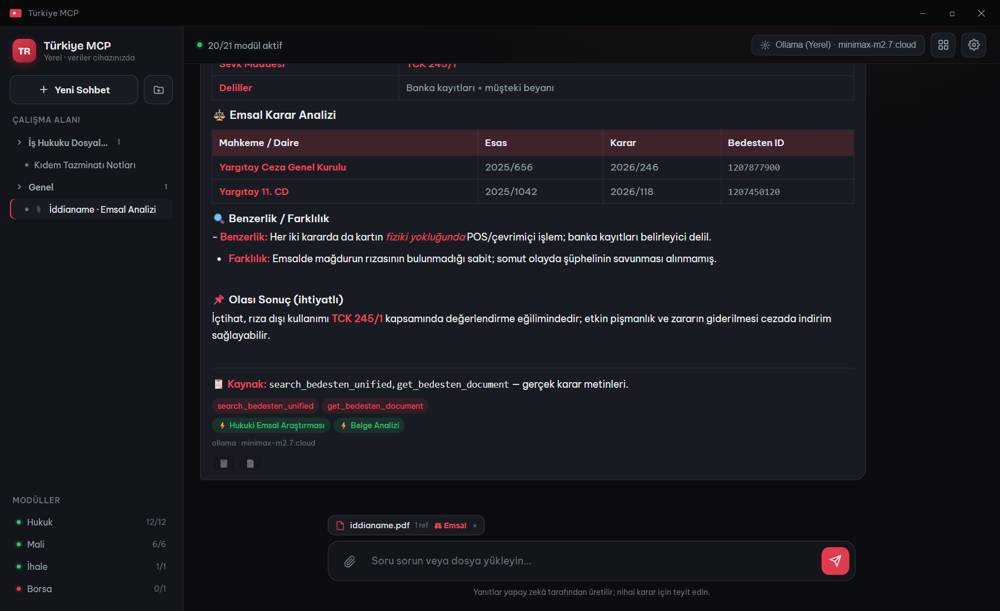
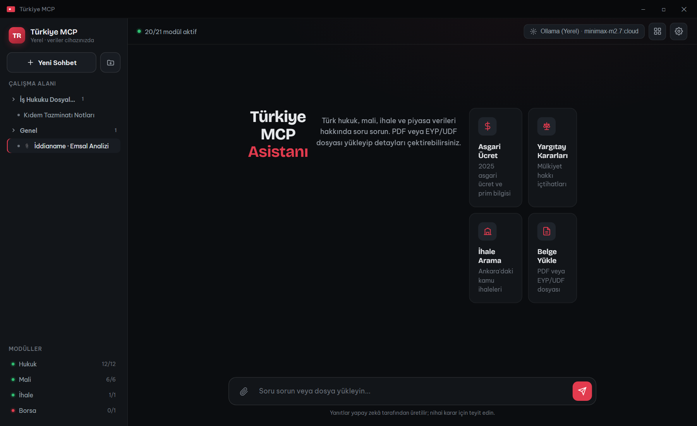
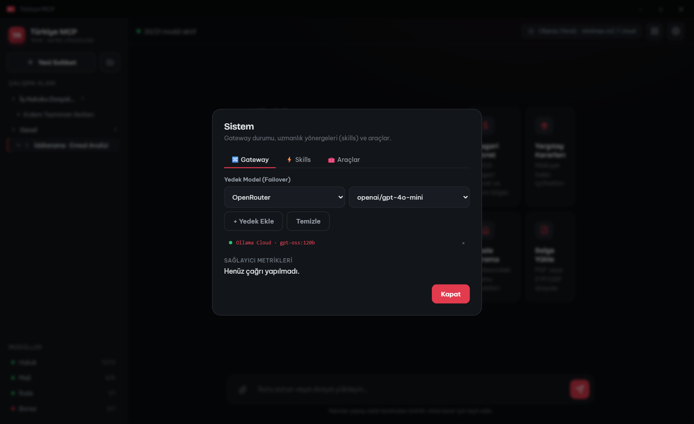
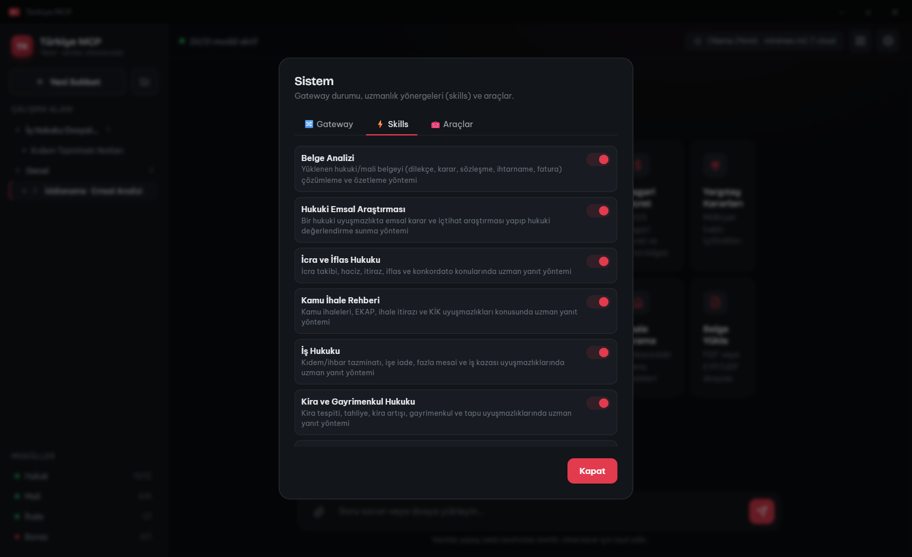
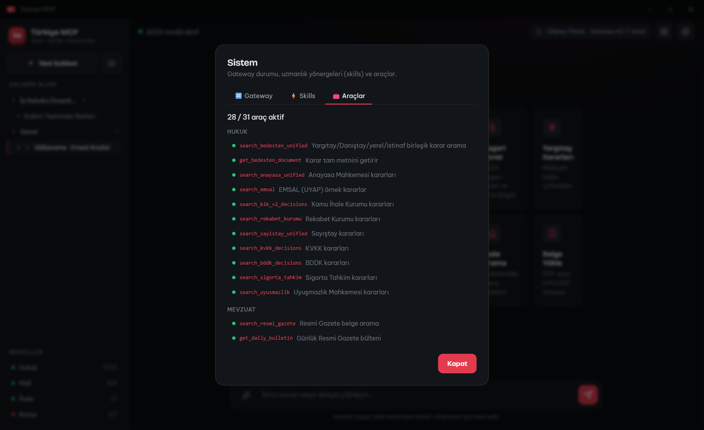
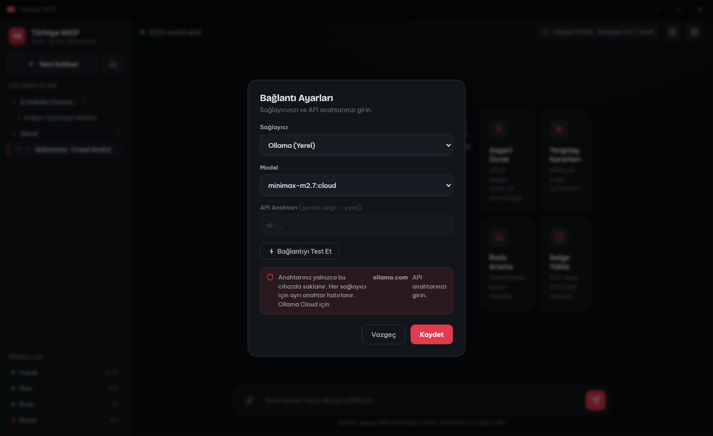

<div align="center">


# 🇹🇷 Türkiye MCP

**Türk hukuk, mali, ihale ve piyasa verileri için yapay zekâ asistanı + MCP sunucusu**

Tek bir masaüstü uygulamasında: Yargıtay, Danıştay, Anayasa Mahkemesi, KİK, Resmi Gazete, GİB, SGK, EKAP ihaleleri, BIST ve daha fazlasına doğal dille erişin. Belge yükleyin, emsal kararları çektirin, sohbetlerinizi klasörlerde saklayın.

[](https://github.com/ayzekhdawy/turkiye-mcp/releases/latest)
[](https://github.com/ayzekhdawy/turkiye-mcp/releases/latest)


### [⬇️ Windows için indir (TurkiyeMCP.exe)](https://github.com/ayzekhdawy/turkiye-mcp/releases/latest)

</div>

<p align="center">
  
</p>

---

## 🖼️ Ekran Görüntüleri

<table>
  <tr>
    <td width="50%"><p align="center"><sub>Karşılama — hızlı başlangıç kartları</sub></p></td>
    <td width="50%"><p align="center"><sub>Belge + emsal analizi (künye & Bedesten ID ile)</sub></p></td>
  </tr>
  <tr>
    <td width="50%"><p align="center"><sub>Sistem · Gateway — yedek model (failover) & metrikler</sub></p></td>
    <td width="50%"><p align="center"><sub>Sistem · Skills — uzmanlıkları aç/kapat</sub></p></td>
  </tr>
  <tr>
    <td width="50%"><p align="center"><sub>Sistem · Araçlar — 31 MCP aracının kataloğu</sub></p></td>
    <td width="50%"><p align="center"><sub>Ayarlar — sağlayıcı, model & bağlantı testi</sub></p></td>
  </tr>
</table>

---

## ✨ Öne Çıkanlar

- **🤖 Doğal dil sohbeti** — "2025 asgari ücret ne kadar?", "Yargıtay mülkiyet hakkı kararları", "Ankara'daki aktif ihaleler" gibi sorulara, ilgili devlet veritabanlarını otomatik tarayarak **kaynaklı ve markdown formatında** yanıt verir.
- **📄 Belge yükle → sor → emsal çektir** — PDF, UYAP (EYP/UDF) veya metin belgesi yükleyin; esas/karar numaraları otomatik çıkarılır, belge bağlam olarak modele iletilir ve **⚖ Emsal** ile ilgili içtihatlar getirilir.
- **🗂️ Çalışma alanı** — Sohbetlerinizi **klasörlere** ayırın, sürükle-bırakla taşıyın. Oturumlar **sunucuda saklanır**; uygulamayı kapatıp açsanız bile **kaldığınız yerden devam** edersiniz.
- **🔌 Kendi modelin (BYOK)** — OpenRouter, OpenAI, Anthropic, Google Gemini, **Ollama (Yerel)** ve **Ollama Cloud** desteği. Yerel Ollama seçilince makinenizdeki modeller (cloud-proxy dahil: `gpt-oss:120b-cloud` vb.) otomatik listelenir. API anahtarınız yalnızca cihazınızda saklanır.
- **🧩 MCP sunucusu** — Aynı araçlar Claude Desktop, Claude Code, Cursor ve VS Code'a **MCP (Model Context Protocol)** üzerinden bağlanır.
- **🖥️ Tek dosya, kurulumsuz** — `TurkiyeMCP.exe`'yi çift tıklayın; ek kurulum gerekmez. Veriler **cihazınızda** kalır.

---

## 📚 Kapsanan Veri Kaynakları

| Alan | Kaynaklar | Araç |
|------|-----------|------|
| ⚖️ **Hukuk / Yargı** | Yargıtay · Danıştay · Anayasa Mahkemesi · KİK · Rekabet Kurumu · Sayıştay · BDDK · KVKK · Sigorta Tahkim · Uyuşmazlık · **EMSAL** · Bedesten | ~13 |
| 📋 **Mevzuat** | Mevzuat Bilgi Sistemi (kanun, KHK, yönetmelik, tebliğ) | ~2 |
| 💰 **Mali / SMMM** | Resmi Gazete · GİB sirküler · İVD (e-Fatura) · SGK · İŞKUR · TÜRMOB · İSMMMO · asgari ücret · vergi takvimi | ~10 |
| 🏗️ **İhale** | Kamu ihaleleri (EKAP v2) · resmi ilanlar (ilan.gov.tr) | ~3 |
| 📈 **Piyasa** | BIST hisseleri · döviz kurları · kripto | ~3 |

**Toplam ~31+ araç** — tümü tek arayüzde.

---

## 🚀 Hızlı Başlangıç

### Seçenek 1 — Hazır Uygulama (önerilen)

1. **[En son sürümü indirin](https://github.com/ayzekhdawy/turkiye-mcp/releases/latest)** → `TurkiyeMCP.exe`
2. Çift tıklayarak çalıştırın (ilk açılışta modüller ~20-30 sn yüklenir).
3. Sağ üstten **⚙ Ayarlar** → sağlayıcı ve model seçin → **⚡ Bağlantıyı Test Et**.
4. Soru sorun, belge yükleyin, klasör oluşturun.

> 💡 **Ücretsiz/yerel kullanım:** [Ollama](https://ollama.com) kuruluysa, Ayarlar'da **Ollama (Yerel)** seçtiğinizde modelleriniz otomatik listelenir ve API anahtarı gerekmez.

### Seçenek 2 — Kaynaktan Çalıştırma

```bash
git clone https://github.com/ayzekhdawy/turkiye-mcp.git
cd turkiye-mcp
pip install -r requirements.txt

# Masaüstü uygulaması (pencere + tray)
python local_run.py

# veya sadece web sunucusu
python -m uvicorn app:starlette_app --host 127.0.0.1 --port 8080
# → http://localhost:8080
```

---

## 🖱️ Arayüz Rehberi

| Bölüm | İşlev |
|-------|-------|
| **+ Yeni Sohbet / 🗂 Yeni Klasör** | Sohbet başlatın, klasör oluşturun; sohbetleri sürükle-bırakla klasöre taşıyın |
| **Çalışma Alanı** | Klasör ağacı; oturumlar sunucuda kalıcı, en son oturum otomatik açılır |
| **📎 Belge ekle** | Composer'daki ataç ile PDF/UYAP/TXT yükleyin → ek "chip" olarak iliştirilir, referanslar çıkarılır |
| **⚖ Emsal** | Ekli belge için emsal kararları ve içtihatları tek tıkla aratır |
| **Model chip / ⚙ Ayarlar** | Sağlayıcı + model + API anahtarı; sağlayıcı başına ayrı anahtar hatırlanır; "Bağlantıyı Test Et" |
| **Modüller** | Aktif/pasif modül sayısı (Hukuk, Mali, İhale, Borsa) gerçek zamanlı |
| **📋 / 📄** | Her yanıtı panoya kopyalayın veya Word (.doc) olarak indirin |

---

## 🔌 Desteklenen LLM Sağlayıcıları

| Sağlayıcı | API Anahtarı | Not |
|-----------|:------------:|-----|
| **Ollama (Yerel)** | ❌ | `localhost:11434`; modeller otomatik listelenir (cloud-proxy dahil) |
| **Ollama Cloud** | ✅ | [ollama.com](https://ollama.com) anahtarı; `gpt-oss`, `deepseek-v3.1`, `qwen3-coder` vb. |
| **OpenRouter** | ✅ | Tek anahtarla çok sayıda model |
| **OpenAI** | ✅ | `gpt-4o`, `gpt-4o-mini` … |
| **Anthropic** | ✅ | `claude-*` |
| **Google Gemini** | ✅ | `gemini-2.0-flash` … |

> 🔒 Anahtarlar yalnızca cihazınızda (`localStorage` + yerel keyring) saklanır, hiçbir sunucuya gönderilmez.

---

## 🧩 MCP Sunucusu Olarak Kullanım

Türkiye MCP, aynı araçları **Model Context Protocol** üzerinden IDE/asistanlara açar. Sunucu çalışırken (`http://localhost:8080`) aşağıdaki istemcilere ekleyebilirsiniz.

<details>
<summary><b>Claude Desktop</b></summary>

`%APPDATA%\Claude\claude_desktop_config.json` (Windows) / `~/Library/Application Support/Claude/claude_desktop_config.json` (macOS):

```json
{
  "mcpServers": {
    "turkiye": { "url": "http://localhost:8080/sse" }
  }
}
```
</details>

<details>
<summary><b>Claude Code (CLI)</b></summary>

```bash
claude mcp add turkiye --transport sse http://localhost:8080/sse
claude mcp list
```
</details>

<details>
<summary><b>Cursor</b> — <code>.cursor/mcp.json</code></summary>

```json
{ "mcpServers": { "turkiye": { "url": "http://localhost:8080/sse" } } }
```
</details>

<details>
<summary><b>VS Code (Copilot)</b> — <code>.vscode/mcp.json</code></summary>

```json
{ "servers": { "turkiye": { "type": "sse", "url": "http://localhost:8080/sse" } } }
```
</details>

---

## 🔌 SSE Bağlantısı (Geliştiriciler için)

Türkiye MCP, **SSE (Server-Sent Events)** transport'u ile çalışır. Bu sayede hem yerel hem de uzak (ör. Railway, Docker) dağıtımlarda HTTP üzerinden bağlanılabilir.

| Endpoint | Yöntem | Açıklama |
|----------|--------|----------|
| `/sse` | `GET` | SSE akışını açar; sunucu bir `session_id` ve mesaj endpoint'i döner |
| `/messages/?session_id=…` | `POST` | JSON-RPC 2.0 mesajları (MCP protokolü) gönderilir |
| `/health` | `GET` | JSON sağlık kontrolü (aktif modüller, skill sayısı) |
| `/` | `GET` | Web dashboard (arayüz) |

**Bağlantı akışı:**

```
1) GET /sse                         → text/event-stream açılır
2) Sunucu "endpoint" event'i yollar → /messages/?session_id=<id>
3) POST /messages/?session_id=<id>  → {"jsonrpc":"2.0","method":"tools/list",...}
4) Yanıtlar /sse akışından event olarak gelir
```

**Hızlı test (curl):**

```bash
# SSE akışını dinle (session_id'yi buradan al)
curl -N http://localhost:8080/sse

# Başka bir terminalde araç listesini iste
curl -X POST "http://localhost:8080/messages/?session_id=SESSION_ID" \
  -H "Content-Type: application/json" \
  -d '{"jsonrpc":"2.0","id":1,"method":"tools/list"}'
```

> **Uzak dağıtım:** Railway/Docker üzerinde `PORT` otomatik atanır. Bağlantı URL'sini `https://<alan-adınız>/sse` olarak verin. Herhangi bir MCP uyumlu istemci (Claude Desktop/Code, Cursor, VS Code, kendi SDK'nız) bu endpoint'e bağlanabilir.

---

## 🧠 "Avukat gibi" yetenekler

Türkiye MCP yalnızca arama yapmaz; **bağlama göre uzmanlaşır**:

- **Belge zekâsı** — Yüklenen belgenin **türünü** (dava dilekçesi, mahkeme kararı, sözleşme, ihtarname, fatura…), **taraflarını** ve **konusunu** otomatik tespit eder.
- **İlgililik denetimi** — Sorunuz yüklediğiniz belgeyle ilgisizse model **kibarca uyarır**, sonra yine de yardımcı olur.
- **Çapraz hafıza** — Aynı esas/karar numarası veya benzer konu başka bir **klasör/sohbette** geçiyorsa, *"Çalışma alanınızdaki '…' kaydında benzer bir durum var"* diyerek sizi yönlendirir.
- **Skills (uzmanlık yönergeleri)** — [`skills/`](skills) dizinindeki, YAML başlık + markdown gövdeden oluşan oyun kitapları (hukuki emsal araştırması, belge analizi, mali müşavirlik, ihale ve daha fazlası) bağlama göre seçilip modele enjekte edilir. Yeni bir `skills/<ad>/SKILL.md` ekleyerek modeli kolayca yeni bir uzmanlıkla donatabilirsiniz.
- **Durdurma** — Yanıt üretilirken **⏹ durdurma** düğmesiyle anında iptal edebilirsiniz.

---

## 🔀 Gateway & Sistem Paneli

Merkezi bir **LLM Gateway** tüm model çağrılarını yönetir:

- **Otomatik failover** — Birincil model hata, zaman aşımı veya **boş yanıt** verirse, tanımladığınız **yedek modellere** sırayla otomatik geçilir (ör. yerel Ollama → Ollama Cloud → OpenRouter). Yanıtta hangi modelin kullanıldığı ve yedeğe geçilip geçilmediği gösterilir.
- **Metrikler** — Sağlayıcı başına başarı/başarısızlık/ortalama gecikme.
- **Reasoning modelleri** (gpt-oss, minimax, deepseek…) için token bütçesi otomatik ayarlanır → "boş yanıt" sorunu giderilir.

Sağ üstteki **▦ Sistem** düğmesi üç sekme sunar:

| Sekme | İçerik |
|-------|--------|
| **🔀 Gateway** | Yedek model (failover) yapılandırması + canlı sağlayıcı metrikleri |
| **⚡ Skills** | 9 uzmanlık yönergesini tek tek **aç/kapat** |
| **🧰 Araçlar** | 31 MCP aracının kategori bazında kataloğu (aktif/pasif) |

---

## 🛠️ Araçlar (Tools)

<details>
<summary><b>⚖️ Hukuk / Yargı</b></summary>

| Araç | Açıklama |
|------|----------|
| `search_bedesten_unified` | Yargıtay/Danıştay/yerel/istinaf birleşik arama (`court_types`) |
| `get_bedesten_document` | Karar tam metni (`document_id`) |
| `search_anayasa_unified` | Anayasa Mahkemesi (bireysel başvuru / itiraz / genel kurul) |
| `search_kik_v2_decisions` | KİK kararları (uyuşmazlık / idari / onarım) |
| `search_rekabet_kurumu` · `search_sayistay_unified` | Rekabet Kurumu · Sayıştay |
| `search_kvkk_decisions` · `search_bddk_decisions` | KVKK · BDDK |
| `search_sigorta_tahkim` · `search_uyusmazlik` · `search_emsal` | Sigorta Tahkim · Uyuşmazlık · EMSAL |

**Bedesten mahkeme kodları:** `YARGITAYKARARI`, `DANISTAYKARAR`, `YERELHUKUK`, `ISTINAFHUKUK`, `KYB`
</details>

<details>
<summary><b>💰 Mali / Mali Müşavir</b></summary>

| Araç | Açıklama |
|------|----------|
| `search_resmi_gazete` · `get_daily_bulletin` · `get_recent_mali_changes` | Resmi Gazete arama / günlük bülten / son N gün |
| `search_gib_sirkuler` · `get_tax_calendar` | GİB sirküleri · vergi takvimi |
| `check_efatura_taxpayer` | VKN/TCKN ile e-Fatura mükellef sorgulama |
| `get_asgari_ucret` · `get_prim_matrahi` | Asgari ücret · SGK prim matrahı |
| `get_turmob_pratik_bilgiler` · `get_ismmmo_pratik_bilgiler` | TÜRMOB · İSMMMO pratik bilgiler |
</details>

<details>
<summary><b>🏗️ İhale &nbsp;·&nbsp; 📈 Piyasa &nbsp;·&nbsp; 🏥 Sağlık</b></summary>

| Araç | Açıklama |
|------|----------|
| `search_tenders` · `get_recent_tenders` · `search_ilan_ads` | EKAP ihale arama · son N gün · resmi ilanlar |
| `get_bist_stock` · `get_fx_rates` · `get_crypto` | BIST hisse · döviz · kripto |
| `check_health` | Tüm modüllerin durumu |
</details>

### Örnek sorular

```
"Yargıtay 'kira tespiti' kararlarını ara ve emsalleri özetle"
"2025 asgari ücret brüt/net ve SGK prim oranları"
"GİB sirkülerlerinde 'KDV tevkifatı' ara"
"Ankara'daki aktif yapım ihaleleri"
"BIST THYAO ve güncel döviz kurları"
```

---

## 🏗️ Mimari

```
turkiye-mcp/
├── app.py            # ASGI uygulaması: dashboard arayüzü + tüm endpoint'ler + MCP mount
├── workspace.py      # Sunucu taraflı klasör / oturum / dosya kalıcılığı (JSON)
├── local_run.py      # Masaüstü giriş noktası: sunucu + pywebview penceresi + tray
├── turkiye_mcp.spec  # PyInstaller derleme spec'i
├── uyap_module/      # UYAP EYP/UDF belge ayrıştırıcı
└── *_mcp_module/ , *_module/   # Her veri kaynağı için ayrı modül (graceful loading)
```

- **Graceful loading:** Her modül bağımsız yüklenir; biri başarısız olursa diğerleri çalışmaya devam eder (`MODULES_AVAILABLE`).
- **Kalıcılık:** Çalışma alanı verisi `%LOCALAPPDATA%\TurkiyeMCP\workspace` altında saklanır (`TURKIYE_MCP_DATA_DIR` ile değiştirilebilir).
- **Transport:** Web dashboard (`/`), JSON sağlık (`/health`), REST API (`/api/*`), MCP SSE (`/sse`).

### Önemli ortam değişkenleri

| Değişken | Varsayılan | Açıklama |
|----------|-----------|----------|
| `PORT` | `8080` | Sunucu portu |
| `TURKIYE_MCP_DATA_DIR` | `%LOCALAPPDATA%\TurkiyeMCP` | Çalışma alanı veri dizini |
| `TURKIYE_MCP_LOCAL` | — | `1` ise yerel mod (keyring ile anahtar saklama) |

---

## 📦 Sürüm & Derleme (CI/CD)

EXE derlemesi **GitHub Actions** ile otomatiktir. Yeni sürüm yayınlamak için tek yapılması gereken bir etiket (tag) göndermektir:

```bash
# pyproject.toml ve release_notes.md güncellendikten sonra
git tag v1.5.0
git push origin v1.5.0
```

`v*` etiketi push edildiğinde [`build-exe.yml`](.github/workflows/build-exe.yml) Windows'ta EXE'yi derler, `release_notes.md` ile bir GitHub Release oluşturur ve `TurkiyeMCP.exe`'yi asset olarak yükler.

**Yerel derleme:**

```bash
pip install pyinstaller
python -m PyInstaller turkiye_mcp.spec --noconfirm --clean
# çıktı: dist/TurkiyeMCP.exe
```

### EXE komut satırı seçenekleri

```bash
TurkiyeMCP.exe              # GUI ile başlat
TurkiyeMCP.exe --no-gui     # Sadece sunucu
TurkiyeMCP.exe --browser    # Tarayıcıda aç
TurkiyeMCP.exe --port 9090  # Farklı port
TurkiyeMCP.exe --debug      # Konsol penceresini göster
```

---

## 📜 Lisans

**Ticari Olmayan Kullanım Lisansı** — bkz. [LICENSE](LICENSE).

Bu yazılım yalnızca **kişisel ve ticari olmayan** amaçlarla ücretsiz kullanılabilir. Satılması, kiralanması, bir ürün/hizmet olarak pazarlanması veya herhangi bir biçimde maddi kazanç sağlanması **yasaktır**. Ticari kullanım için telif hakkı sahibinden yazılı izin gerekir.

## 🙏 Teşekkürler

- [yargi-mcp](https://github.com/saidsurucu/yargi-mcp) — Türk hukuk veritabanları
- [mevzuat-mcp](https://github.com/saidsurucu/mevzuat-mcp) — Mevzuat Bilgi Sistemi
- [ihale-mcp](https://github.com/saidsurucu/ihale-mcp) — Kamu ihale arama
- [borsa-mcp](https://github.com/saidsurucu/borsa-mcp) — Borsa verileri
- [musavir-mcp](https://github.com/ayzekhdawy/musavir-mcp) — Mali müşavir araçları

---

<div align="center">
<sub>⚠️ Yanıtlar yapay zekâ tarafından üretilir; hukuki/mali nihai kararlar için resmi kaynaklardan teyit ediniz.</sub>
</div>
